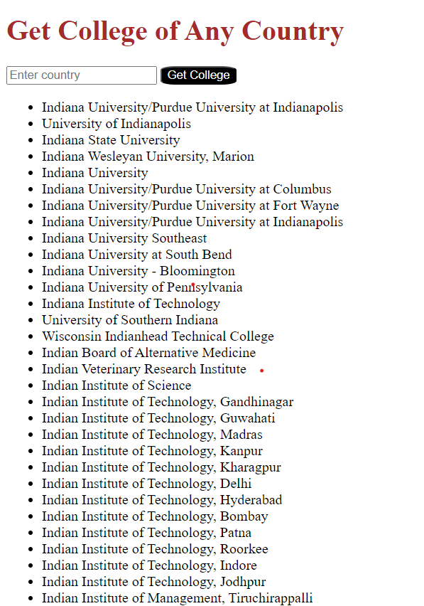

# College Finder

This project is a simple web application that allows users to get information about colleges in any country.

## Image 
 
 
 
 

## Table of Contents

- [Description](#description)
- [Usage](#usage)
- [Technologies Used](#technologies-used)
- [Contributing](#contributing)

## Description

The College Finder web application allows users to input a country and retrieve a list of colleges from that country. It utilizes an external API to fetch the college data.

## Usage

To use the College Finder:

1. Enter the name of the country you're interested in the input field.
2. Click the "Get College" button.
3. The list of colleges in the entered country will be displayed below.

## Technologies Used
1. HTML
2. CSS
3. JavaScript
4. Axios (for making HTTP requests)

## Contributing
Contributions to this project are welcome. If you'd like to contribute, please follow these steps:

1. Fork the project.
2. Create your feature branch (git checkout -b feature/YourFeature).
3. Commit your changes (git commit -am 'Add some feature').
4. Push to the branch (git push origin feature/YourFeature).
5. Open a pull request.

